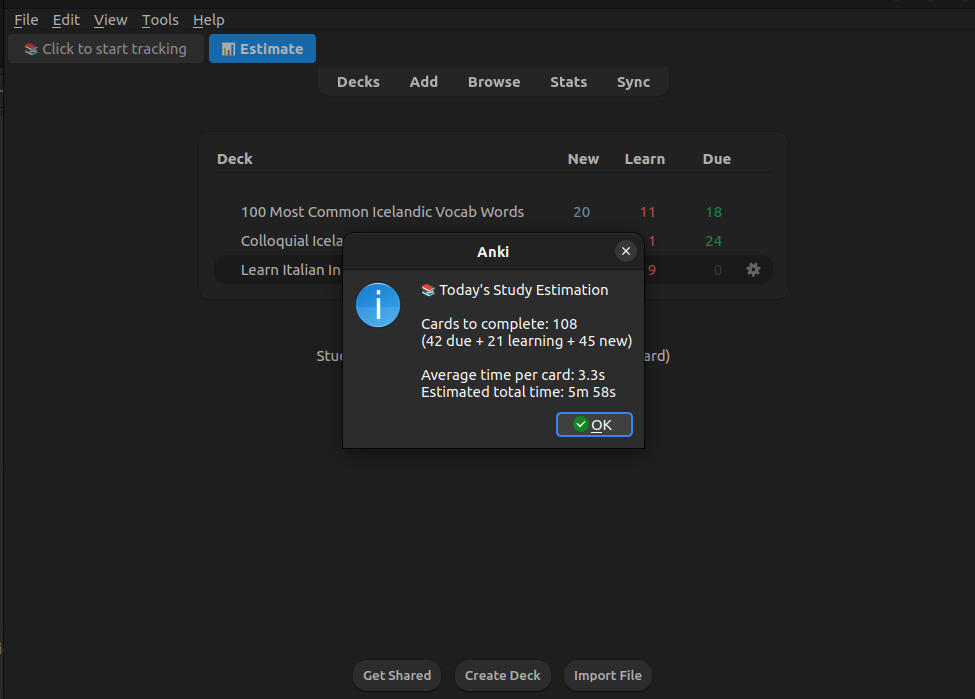
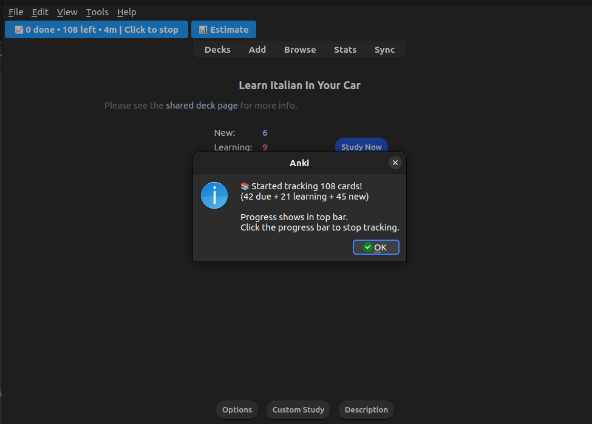
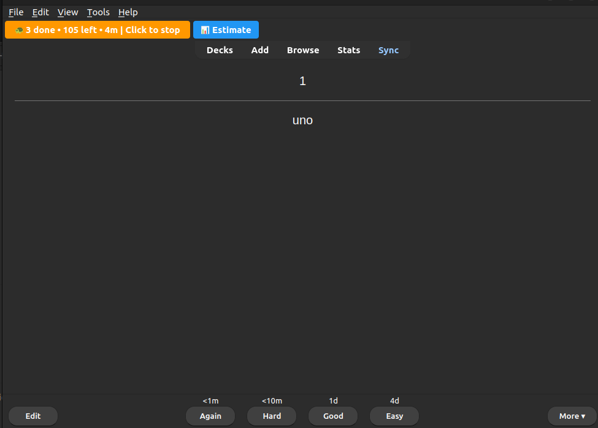

# Anki Completion Time Estimator

Predicts how long your Anki study session will take and tracks your progress in real-time.

## 📸 Screenshots

| Daily work estimator | Tracking started | Tracking in progress |
| :---: | :---: | :---: |
|  |  |  |

## Features
- 📊 **Predict Button**: Shows estimated time to complete all today's cards
- 📚 **Progress Tracker**: Live tracking of cards completed during your session
- 🚀 **Pace Indicator**: Shows if you're studying faster or slower than average:
	📈 - normal pace
	🚀 - 20% faster than usual 
	🐢 - 20% slower than usual
- ⏱️ **Time Remaining**: Updates in real-time as you study

## Usage
1. Click "📊 Predict" to see how long today's cards will take
2. Click "📚 Click to start tracking" to begin progress tracking
3. Study normally - the progress bar updates automatically
4. Click the progress bar again to stop tracking

## Notes
- Counts cards across all decks
- Respects daily limits for new cards
- Based on your recent average review times
